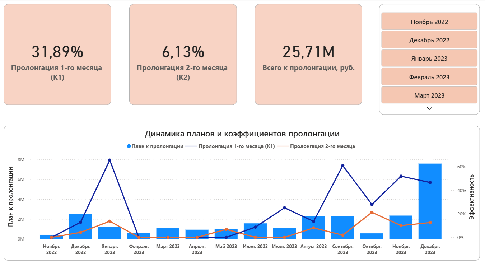
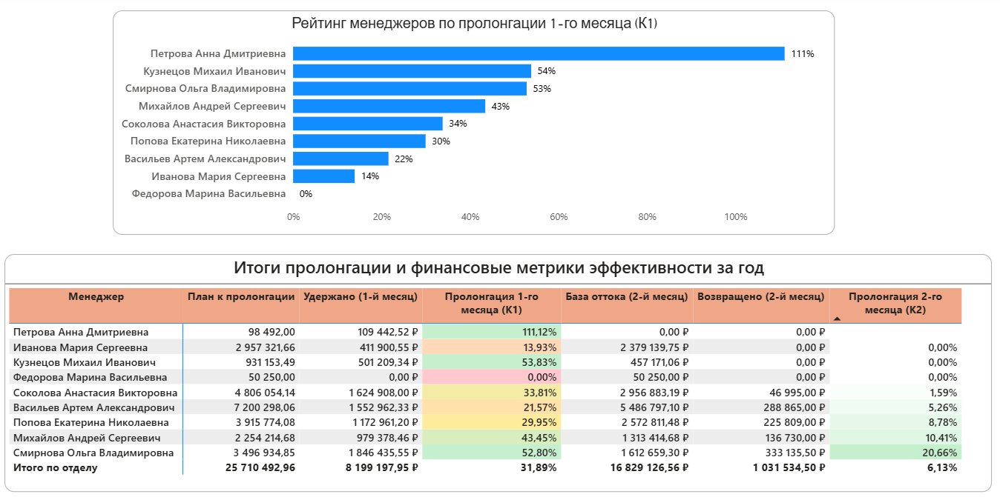
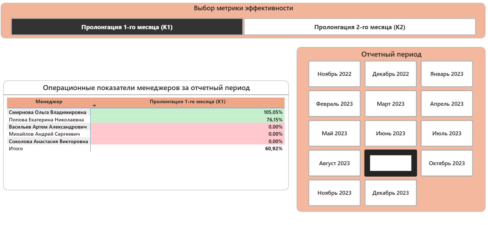
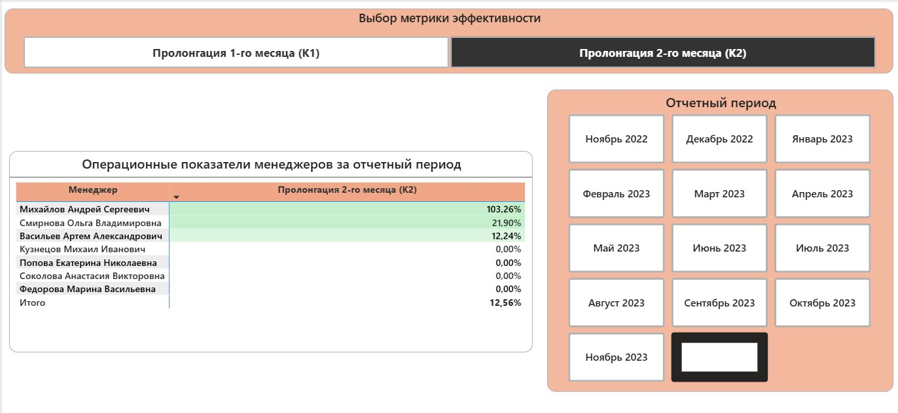

<sub>📊 [Подробная методология расчёта KPI](power_query/methodology.md)</sub>

# Анализ клиентских пролонгаций и эффективности менеджеров отдела сопровождения

## Описание

**Цель проекта:** Оценить эффективность менеджеров отдела сопровождения в процессе пролонгации клиентских проектов, выявить слабые этапы удержания и определить точки роста для повышения эффективности отдела.

**Инструменты:**
- Excel
- Power Query
- Power BI

**Используемые навыки:**
- Data Cleaning
- Data Transformation
- KPI Analysis
- Dashboard Development
- Business Analytics

---

## Структура проекта

```
renewal-analytics/
│
├── data/                              # Исходные данные
│   ├── prolongations.csv              # Завершённые проекты: ID, месяц закрытия, менеджер
│   ├── financial_data.csv             # Помесячные отгрузки по проектам
│
├── power_query/                       # Скрипты и документация по обработке
│   ├── methodology.md                 # Подробная методология расчёта KPI (формулы, логика)
│
├── report_excel/                      # Итоговый управленческий отчёт
│   ├── KPI_prolongation_report.xlsx   # Сводный Excel-файл с KPI и сводными таблицами
│
├── dashboard/                         # Интерактивный дашборд
│   ├── renewal_dashboard.pbix         # Файл Power BI со всеми визуализациями
│
├── visualizations/                    # Экспортированные скриншоты дашборда
│   ├── pbi_dashboard_overview.png     
│   ├── pbi_dashboard_managers.png    
│   ├── pbi_matrix_k1.jpg              
│   ├── pbi_matrix_k2.jpg
|   ├── ...                            
│
└── README.md                          # Основное описание проекта 
```

---

## 1. Бизнес-задача

Руководителю отдела сопровождения клиентов требовалось оценить эффективность работы менеджеров отдела сопровождения по продлению клиентских проектов.

Для анализа были рассчитаны два ключевых показателя:

- **Коэффициент пролонгации 1-го месяца**  
  отношение суммы проектов, продленных в первый месяц после завершения, к объему завершенных проектов.

- **Коэффициент пролонгации 2-го месяца**  
  отношение суммы проектов, продленных во второй месяц после завершения, к объему проектов, не продленных в первый месяц.

---

## 2. Исходные данные

Использовались два источника данных:

**`prolongations.csv`**  
Содержит:
- ID проекта
- месяц завершения проекта
- ответственного менеджера отдела сопровождения

**`financial_data.csv`**  
Содержит:
- ID проекта
- помесячные данные по отгрузкам
- ответственного менеджера
- дополнительные технические поля, влияющие на дробление транзакций

**Схема данных:**

```
prolongations (1)
       |
       | id
       |
       ↓
financial_data (*)
```

---

## 3. Подготовка данных

В процессе подготовки данных были выполнены следующие операции:

- Очистка специальных значений
- Проверка качества данных
- Нормализация структуры (Unpivot)
- Агрегация финансовых операций
- Объединение источников

---

## 4. Методика расчета

Для каждого проекта рассчитывалась разница между месяцем завершения проекта и месяцем последующей отгрузки.

Использовались следующие периоды:
- **0** — последний месяц проекта
- **1** — первый месяц после завершения
- **2** — второй месяц после завершения

**KPI 1** (коэффициент пролонгации первого месяца):  
= Отгрузка в первый месяц / База завершённых проектов

**KPI 2** (коэффициент пролонгации второго месяца):  
= Отгрузка во второй месяц / База проектов без пролонгации в первый месяц

### Техническая реализация KPI

После подготовки итоговой таблицы Base финальные коэффициенты пролонгации были реализованы в Power BI через DAX-меры.  
Это позволило:
- динамически пересчитывать KPI по фильтрам;
- использовать единый расчёт для всех аналитических отчётов;
- строить интерактивные dashboard-сценарии без дублирования логики.

Для детального анализа по менеджерам был реализован параметр переключения метрик (KPI1 / KPI2) внутри единой матрицы Power BI.

---

## 5. Результаты анализа

### Отдел в целом:

По итогам анализа было установлено:
- основная часть пролонгаций происходит в первый месяц после завершения проекта;
- коэффициент пролонгации второго месяца значительно ниже;
- во втором полугодии показатели удержания улучшились.

### Менеджеры:

Анализ показал существенную разницу в эффективности менеджеров отдела сопровождения.  
Были выявлены:
- сотрудники с наиболее высокими показателями пролонгации;
- сотрудники с низкой конверсией, требующие дополнительного анализа;
- отдельные случаи коэффициентов выше 100%, требующие дополнительной проверки бизнес-логики и структуры данных.

По итогам был разработан KPI-отчёт и дашборд для регулярного мониторинга эффективности.

---

## 6. Дашборд

Разработан интерактивный дашборд в Power BI, включающий:

### 1. Общий обзор отдела сопровождения 



**Что показывает:**
- динамику коэффициентов пролонгации;
- объём удержанных клиентов;
- изменение KPI по месяцам.

**Вывод:** Основная часть пролонгаций происходит в первый месяц после завершения проекта. Во втором полугодии наблюдается рост показателей удержания.

---

### 2. Рейтинг менеджеров  



**Что показывает:**
- сравнение эффективности сотрудников;
- лидеров и сотрудников с низкой конверсией.

**Вывод:** Результаты менеджеров существенно различаются. Это позволило выявить наиболее эффективные практики работы с клиентами и зоны для дополнительного контроля.

---

### 3. Детализация KPI пролонгации по менеджерам и месяцам  

**Пролонгация 1-го месяца:**



**Пролонгация 2-го месяца:** 




**Что показывает:**
- матрицу «менеджер × месяц»;
- сезонность;
- нестабильные периоды.

**Вывод:** Помесячная детализация помогла выявить периоды просадки, нестабильность отдельных сотрудников и сегмент клиентов без закреплённого менеджера.

---

## 7. Выводы и рекомендации

По итогам анализа были сформулированы следующие выводы и рекомендации:

1. **Основная часть пролонгаций происходит в первый месяц после завершения проекта.**  
   Первый месяц является ключевым этапом удержания клиента.

2. **Коэффициент пролонгации второго месяца значительно ниже коэффициента первого месяца.**  
   Это подтверждает снижение вероятности возврата клиента при отсутствии своевременного продления.

3. **Эффективность менеджеров отдела сопровождения существенно различается.**  
   Анализ позволил выявить как наиболее успешные практики работы, так и зоны для повышения эффективности отдельных сотрудников.

4. **Для повышения уровня удержания рекомендуется усилить работу с клиентами до завершения проекта.**  
   Раннее взаимодействие увеличивает вероятность своевременной пролонгации.

5. **Практики менеджеров с высокими показателями могут быть масштабированы на весь отдел.**  
   Это позволит стандартизировать успешные подходы к работе с клиентами.

6. **Для клиентов, не продливших проект в первый месяц, рекомендуется внедрить отдельный процесс повторного сопровождения.**  
   Это поможет повысить вероятность возврата во втором месяце.

---

## Результат проекта

В результате проекта была разработана автоматизированная аналитическая модель оценки клиентских пролонгаций, включающая подготовку данных в Power Query, формирование KPI-модели, расчёт показателей через DAX и управленческий dashboard для регулярного мониторинга эффективности менеджеров отдела сопровождения.